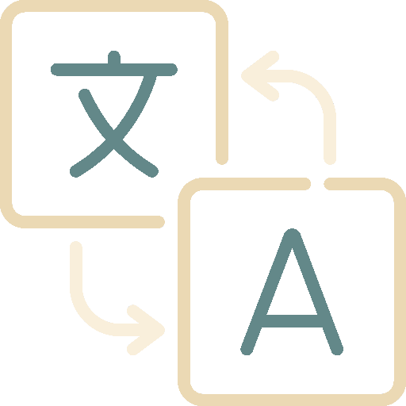
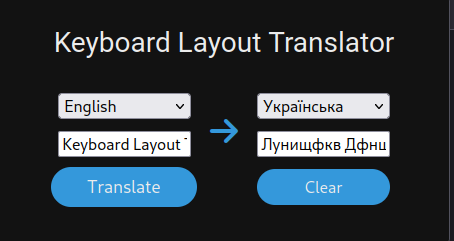
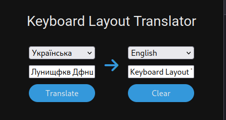

# Keyboard Layout Translator

Keyboard Layout Translator has [Ukrainian :ukraine:](#gthtrkflfx-ukraine) and [English :uk:](#gthtrkflfx-uk) localizations

## Keyboard Layout Translator :ukraine:

<p align="center">
  
</p>

**_Keyboard Layout Translator_** - це розширення для Firefox, яке дозволяє перекласти текст, набраний неправильною мовною розкладкою, у правильний варіант.

**_Ліцензія:_** MIT LICENSE

**_Мінімальна підтримувана версія:_** Firefox 109.0

### Опис роботи

<p align="center">
  
</p>

Розширення дозволяє ввести в спеціальне поле текст з помилками, виниклими через невідповідність розкладки. Після натискання кнопки "Перекласти" розширення аналізує текст і виправляє помилки розкладки, виводячи результат у сусіднє поле.

### Інструкція з використання

1. Встановити розширення
2. Відкрити нову вкладку в Firefox
3. Увести пошкоджений текст в ліве поле
4. Натиснути кнопку "Translate"
5. Перекладений текст з'явиться у правому полі

### Інструкція з збірки розширення

1. Клонуйте репозиторій

```bash
git clone https://github.com/NikitaBerezhnyj/Keyboard_Layout_Translator.git
```

2. Перейдіть до директорії розширення

```bash
cd Keyboard_Layout_Translator
```

3. Збірка розширення через Makefile

```bash
make
```

### Посилання

**_Розширення можна завантажити за посиланням:_** <a href="https://addons.mozilla.org/uk/firefox/addon/keyboard_layout_translator/">https://addons.mozilla.org/uk/firefox/addon/keyboard_layout_translator/</a>

## Keyboard Layout Translator :uk:

<p align="center">
  
</p>

**_Keyboard Layout Translator_** is a Firefox extension that allows you to translate text typed in the wrong language layout into the correct one.

**_License:_** MIT LICENSE

**_Minimum Supported Version:_** Firefox 109.0

### Description work

<p align="center">
  
</p>

The extension allows you to enter text with errors in a special field due to a mismatch in the layout. After clicking the "Translate" button, the extension analyzes the text and corrects the layout errors, displaying the result in the next field.

### Instructions for use

1. Install the extension
2. Open a new tab in Firefox
3. Enter the damaged text in the left field
4. Click the "Translate" button
5. The translated text will appear in the right field

### Instructions for assembling the extension

1. Clone the repository

```bash
git clone https://github.com/NikitaBerezhnyj/Keyboard_Layout_Translator.git
```

2. Change to the extension directory

```bash
cd Keyboard_Layout_Translator
```

3. Building the extension through the Makefile

```bash
make
```

### Links

**_The extension can be downloaded here:_** <a href="https://addons.mozilla.org/uk/firefox/addon/keyboard_layout_translator/">https://addons.mozilla.org/uk/firefox/addon/keyboard_layout_translator/</a>
